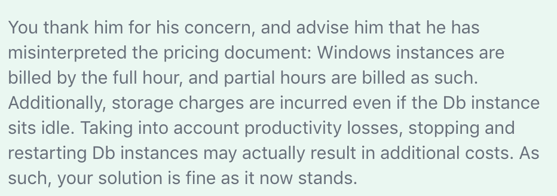

# Placement Group
https://docs.aws.amazon.com/AWSEC2/latest/UserGuide/placement-groups.html

Spread Placement Groups are recommended for applications that have a small number of critical instances which need to be kept separate from each other. Launching instances in a Spread Placement Group reduces the risk of simultaneous failures that might occur when instances share the same underlying hardware. Spread Placement Groups provide access to distinct hardware, and are therefore suitable for mixing instance types or launching instances over time. 

## Cluster
A logical grouping of instances within a single Availability Zone.

Can span peered VPCs in the same Region.

Instance are placed in the same high-bisection bandwidth segment of the network.

Enjoy a higher per-flow throughput limit of up to 10 Gbps for TCP/IP traffic.

Recommended for applications that benefit from low network latency, high network throughput, or both.

Use a single launch request to launch the number of instances that you need in the placement group.

Use the same instance type for all instances in the placement group.

## Partition
Help reduce the likelihood of correlated hardware failures.

Each partition within a placement group has its own set of racks.

Each rack has its own network and power source.

Amazon EC2 tries to distribute the instances evenly across the number of partitions that you specify. You can also launch instances into a specific partition.

A partition placement group can have partitions in multiple Availability Zones in the same Region.

A partition placement group can have a maximum of seven partitions per Availability Zone. 

## Spread
A group of instances that are each placed on distinct racks.

Recommended for applications that have a small number of critical instances that should be kept separate from each other.

Can span multiple Availability Zones in the same Region. 

Maximum of seven running instances per Availability Zone per group.

# Biling

* 

# Misc

Controlling which Auto Scaling instances terminate during scale in http://docs.aws.amazon.com/AutoScaling/latest/DeveloperGuide/AutoScalingBehavior.InstanceTermination.html

For all new AWS accounts, there is a soft limit of 20 EC2 instance per region. You should submit increase form. Only running instances count against your limit.

Underlying Hypervisor for EC2: Xen and Nitro

http://169.254.169.254/latest/meta-data/local-ipv4

http://169.254.169.254/latest/meta-data/public-ipv4

NLB doesn't support custom security policy

Only public IPv4 will change, private IPv4 and any IPV6 will retain after restart

ASG is in a single VPC

ClassicLink links classic EC2 to VPC

EC2 provide Enhance Network Adapter, you need to install ENA module and enable ENA support. --ena-support

EC2 use user data to run custom scripts or configurations

Two types of user data: shell and cloud-init directives; You can also pass this data into the launch wizard as plain text, as a file (this is useful for launching instances using the command line tools), or as base64-encoded text (for API calls).

If already have public IP, no need for elastive IP

Launch permissions, S3 bucket permissions, and user-defined tags must be copied manually to an instance based on an AMI. User data is part of the AMI, itself, and does not need to be copied manually.

Instance store volumes are ephemeral, meaning that they exist ONLY in conjunction with their accompanying EC2 instance.

# ASG
ASG has lifecycle hooks that can be called before termination a node (putting instance to waiting status)

CloudWatch alarm period can be adjusted trigger scaling policy

* Manual scaling
* Dynamic scaling
  * Target tracking (recommended)
  * Step
  * Simple
* Scheduled scalling (when you know when and how long)

Hibernate is not supported for EC2 instances in ASG

# Security Group
Security Groups operate at the instance level, they support "allow" rules only, and they evaluate all rules, not in number order, before deciding whether to allow traffic.