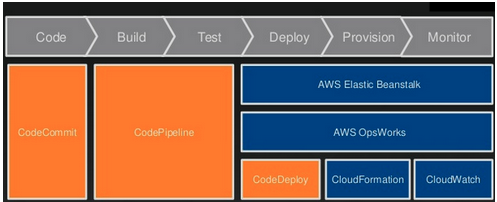

* The maximum response time for a Business Level 'production down' Support Case: 1 hour
* For level of AWS premium support: Basic, Developer, Business and Enterprise
* IAM Roles and Route 53 are across region, EC2 key pair, Security Group and ELB are region specific
* AWS SSO max session duration is 12 hours
* DynamoDB and S3 use VPC Gateway Endpoint, others use VPC Interface Endpoint
* To receive hourly benefits of RI from other accounts, should laude instance in any AZ in same region.
* RI can control how may phisical core and sockets
* Web server should be in private subnet when there is ELB
* 
* DataSync is used to transfer big amount of data to and from AWS storages remotely/online
* Snowball is used to ship data physically from on-prem to AWS storages
* Server Migration Service is used to replicate live server volumns to move on-prem workload to AWS
* Database Migration Service is used to migrate databases to Aws
* CloudHSM Ephemeral backup key is used to encrypt data, and Persistent backup key (PBK) is used to encrypt EBK
* CloudHSM needs to be in same region as storage
* Snowball has 50T and 80T model
* PrivateLink provides secure private access to various AWS services
* Enableing sharing in master account of the organization
* Use Data Sync transfering data from on-prem to AWS online
* S3 object ACL can control access of single file for a OAI
* By default, AWS Organization  has Service Control Policy (SCP) that allows all AWS access
* OpsWork Stack
* AWS Organization SCP: High level org SCP will overwrite sub org's SCP
* Migrate user account from Org A to Org B: Delete master account from Org A and invite from Org B
* Migrate master account from Org A to Org B: Delete master account from Org A and invite from Org B
* Resource Acces Manager https://docs.aws.amazon.com/ram/latest/userguide/what-is.html
* ELB can invoke Lambda
* With the Resource Groups tool, you use a single page to view and manage your resources.