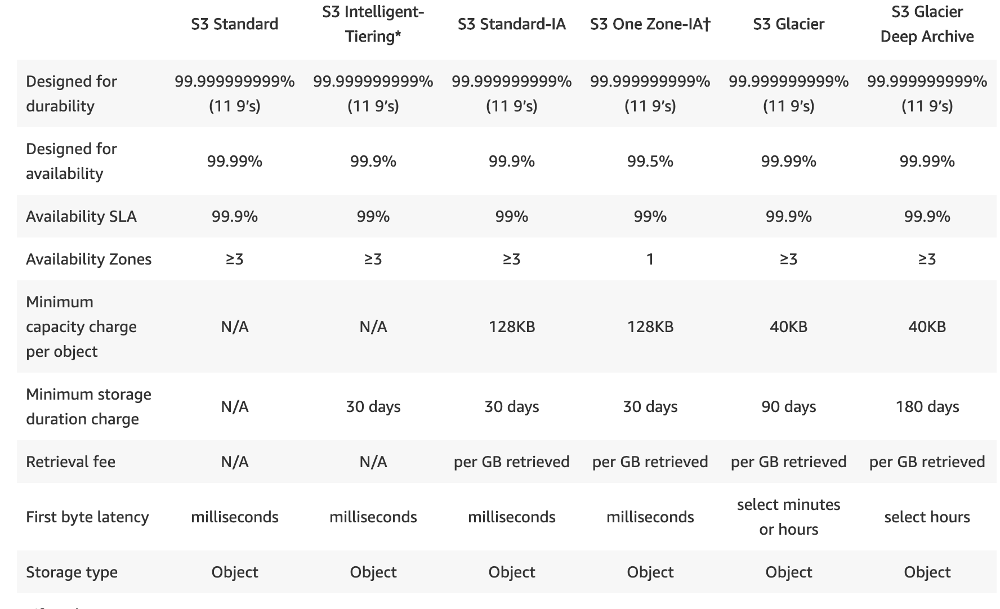

# Server Side Encryption

SSE-S3 -  S3 managed data and master keys
SSE-C  -  you managed keys
SSE-KMS - AWS manage data key, you manage master key in KMS

# Misc

You cannot automatically delete or put delete marker on Glacier

By default, S3 bucket is private only owner (AWS account) can access it unless grant access to roles and resources. Access needs to explicitly granted.

Cross-region repliation

When access pattern is unpredictable, use S3 intelligent-tiering storage class

S3 select support 3 formats: JSON, CSV and Parquet

S3 select supports 2 compression format for JSON and CSV: GZIP and BZIP

System meta 

S3 bucket will automatically enable permission for Log Delivery group when it is selected as target for logging

S3 offers eventual consistency for overwrite PUT and delete
S3 offers read-after-write consistency for new objects

Single file size: 0Byte - 5TB

Delete marker, delete api only put delete marker on object

Transfer Acceleration - upload from all over world
https://docs.aws.amazon.com/AmazonS3/latest/dev/transfer-acceleration.html#transfer-acceleration-why-use

Cross region replication - version enabled on both source and target buckets

S3 is not a VPC service, you cannot use VPC flow log to monitor S3, use Cloud Trail instead

Bucket level properties:
* Versioning
* Server access logging
* Object-level logging
* Static website hosting
* Tags
* Transfer acceleration
* Events

Single put operation can upload max 5G, use multi-part upload for big files

# Glacier

Expedited retrieval - 1-5 minutes

Bulk retrievel - 5-12 hours

Standard retrival - couple of hours

To restore objects from Glacier Deep Archive, restore it from Glacier Console, then copy these objects to required S3 location

Glacier Select can query data directly from Glacier using simple SQL

Vault Lock Policy is used to lock user from performing specific action on S3 Glaciers. Vault Access Policy is used to grant permission to access files in Glaciers.